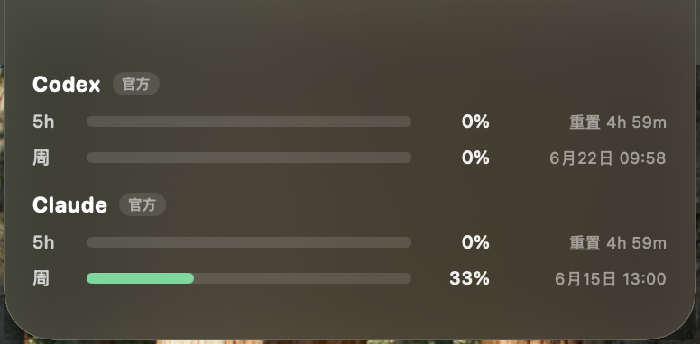

# NotchIsland

把 MacBook 刘海变成一个用量灵动岛，一眼看 **Codex** 和 **Claude** 的剩余额度与重置时间。原生 SwiftUI + AppKit，默认纯本地（Claude 官方用量为可选授权项，开启后才联网）。

<p align="center">
  
</p>

## 它做什么

- **折叠态**：贴刘海左右两翼，各放一枚 5h 额度小环（左 Codex / 右 Claude），停在菜单栏高度内、不下垂，缓慢呼吸。
- **展开态**：悬停或点击向下掉出毛玻璃面板，行式列表展示每个 Provider 的 5h + 周双窗口（用量条 + 百分比 + 重置时间）。5h 显示倒计时，周显示具体日期。

## 数据来源（纯本地）

| Provider | 来源 | 精度 |
|---|---|---|
| Codex | 最新会话 rollout 的 `rate_limits`（5h + 周） | 官方精确 |
| Claude（默认） | `ccusage` 本地 token 估算（仅 5h） | 估算 |
| Claude（授权后） | Anthropic 官方用量接口 `api/oauth/usage`，5h + 周 | 官方精确 |

**Claude 官方用量默认关闭**。在设置里手动开启「启用官方用量」并确认授权后，App 才会读取本机 Claude 登录凭证（OAuth token，取自 `~/.claude/.credentials.json` 或 macOS Keychain `Claude Code-credentials`）并调用官方用量接口，获取你账号的精确 5h / 周限额。数据仅本地使用、不外传，可随时关闭。这是访问**你自己账号**的用量、需**你显式授权**——所以代码开源、行为透明。

> 注意：官方端点为非公开接口，属逆向用法（桌面客户端不渲染 statusLine，无其他可靠来源）。调用已做克制：后台缓存 2 分钟、仅在你查看灵动岛时实时拉取。

## 安装 / 运行

```bash
# 开发运行
bash Scripts/bundle.sh debug && open build/NotchIsland.app

# 正式安装到 /Applications
bash Scripts/install.sh
```

### 启用 Claude 官方用量采集

在 `~/.claude/settings.json` 加：

```json
"statusLine": {
  "type": "command",
  "command": "/Users/<你>/.notchisland/claude-statusline.py"
}
```

下次 Claude Code 产生 API 响应后，官方 5h + 周限额开始落盘。底部状态栏也会顺带显示 `模型 · 5h X% · 7d Y%`。

## 结构

```
Sources/
  NotchUsageKit/        数据层（与 UI 无关）
    Models.swift          UsageSnapshot / UsageWindow
    CodexProvider.swift   读 Codex 会话 rate_limits
    ClaudeProvider.swift  读采集文件 / 回退 ccusage
  NotchIslandApp/       菜单栏 App
    NotchGeometry.swift   刘海几何
    NotchPanel.swift      透明贴刘海面板
    IslandRootView.swift  折叠↔展开视图
    UsageStore.swift      轮询调度
    ...                   设置页 / 登录启动 / 主题
Scripts/
  claude-statusline.py  Claude 官方用量采集器
  bundle.sh / install.sh
notch-probe             命令行用量探针（调试用）
```

## 设置

菜单栏图标 / 右击灵动岛 → 设置：轮询间隔（5/10/30/60 秒）、开机自动启动、启用官方用量。
